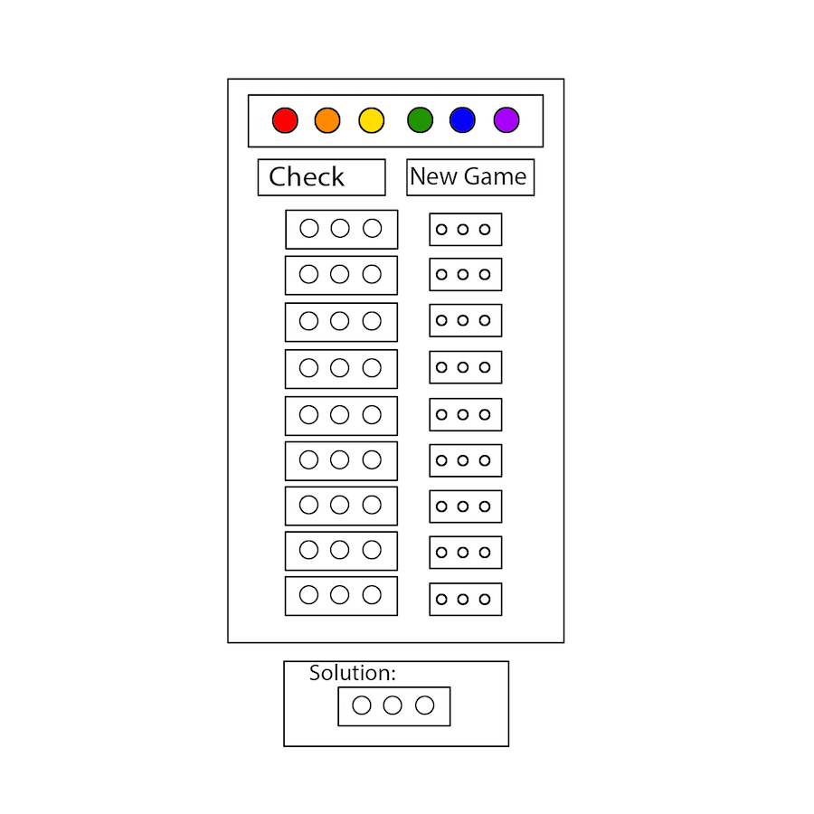
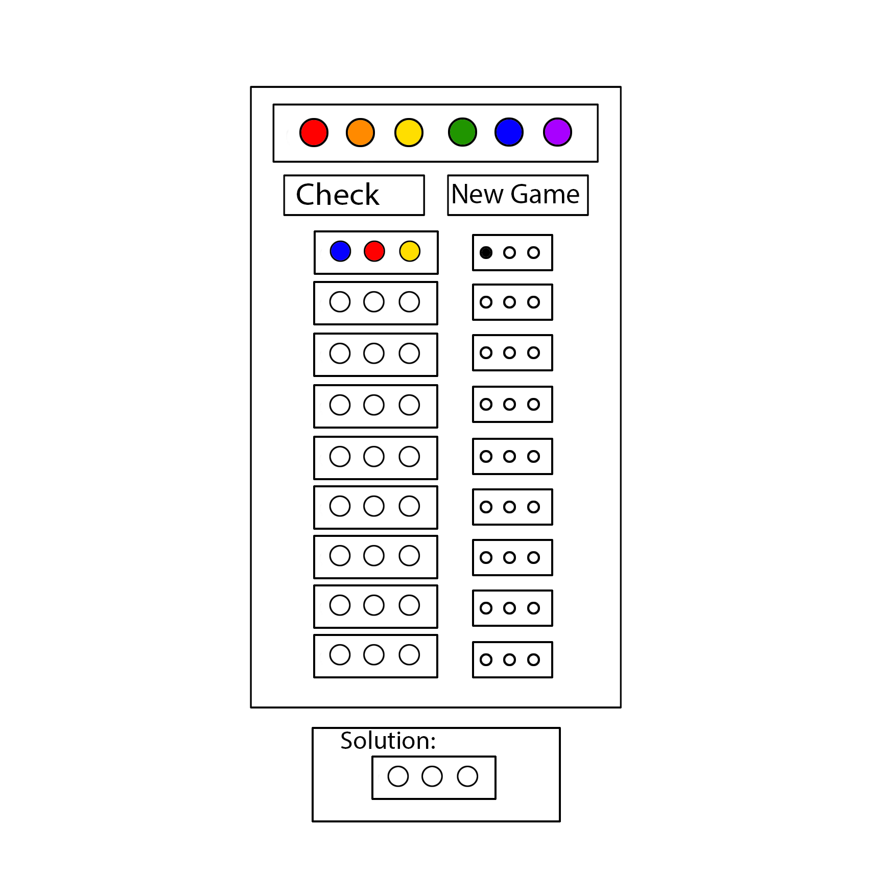
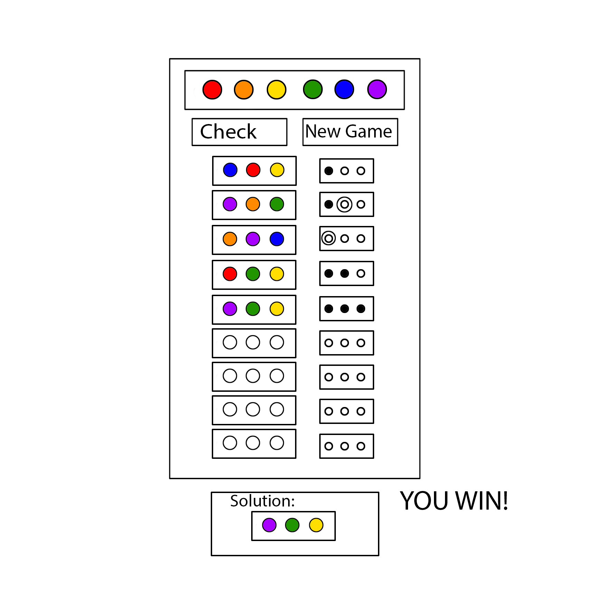

# **Master-Mind-Project1**
## **Overview**
Master Mind is a deductive reasoning game.
The player’s task is to guess the secret code.
The code is a hidden selection of 3 out of 6 random colors: *Red, Orange, Yellow, Green, Blue, Purple*.
## **Game Rules**
Solve the code by selecting colors to play and checking them against the secret code. 
Each time you guess/check, you are given clues about your code, using smaller pegs: *black* indicates right color and right position, *white* indicates right color. Use deductive reasoning to solve the code.

You win if you guess the code correctly.
You lose if you exhaust the number of turns allowed (9). 

## **Wireframes**

## **Use Story**
When the player loads the game, there will be:
- an empty board, with 9-12 rows 
- a secret code area/row 
- 6 colored peg options to choose from 
- a check guess button
- a new game button 
- an explanation of the rules/instructions  

The game/computer has selected 3 colors; they are hidden in the secret code area.

To play: a users selects a color (by clicking on that color), that color is loaded on to the board (L—>R). 

When the player has chosen 3 colors & ready to check/guess their code, they select “Guess/Check”

When “Guess/Check” is selected the game checks to see if the code is correct. 

If the player guesses the secret-code correctly, the solution will appear and the game will inform the player that they have won. 

If the code is not correct the game will provide clues, using black and/or white pegs.
- If there are no correct guesses, there will be no peg clues. 
- A black peg means that one of your guesses is the right/correct color AND in the correct position.
- A white peg means that one of your guesses the right color. 

The player guesses again using new information derived from the clues.

All of the guesses and the peg clues remain on the board.

New guesses & clues are loaded onto the next available row. 

## **MVP**
A three color code, guess/check the code, recieve clues, 9 chances to win/lose. 
## **Stretch Goals**
- delete button: if the player wants to remove their colors before they guess, they can select “Delete”
- alternately, guesses could be loaded/removed manually somehow instead of just L to R 
- provide the option to increase the secret code to 4+ colors
- provide the option to allow repeating colors and blacks in the secret code
- provide the option to make the game easier/harder by increasing/decreasing number of guesses the play can have
- keep track of how many games the player has won/lost

